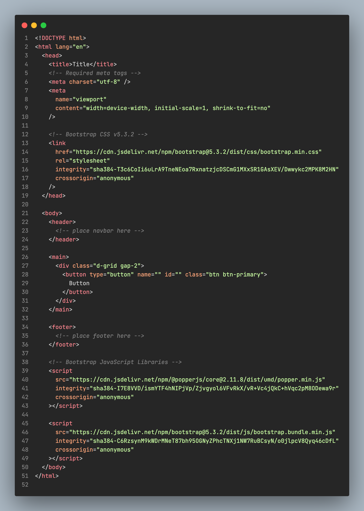
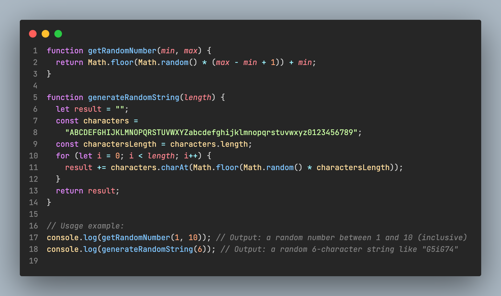
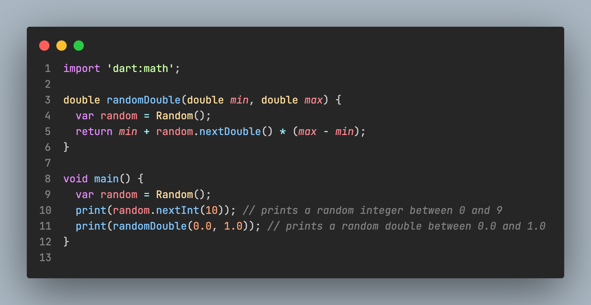
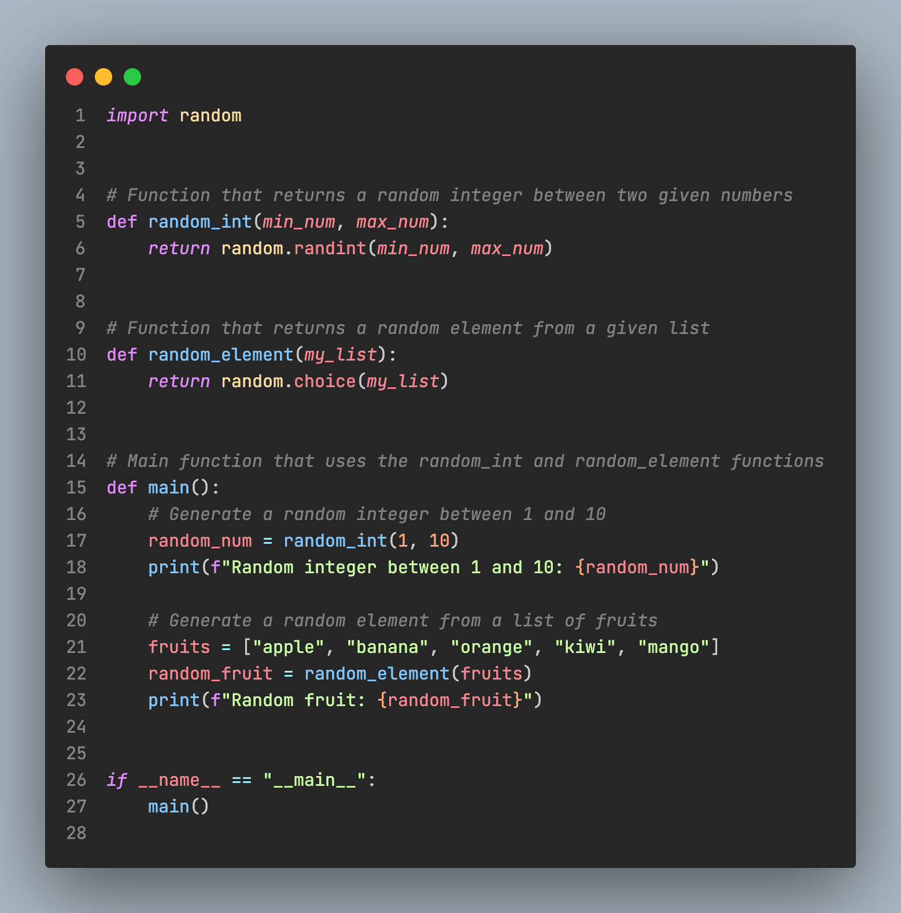

# Dark Theme VSCode

A dark theme for VSCode.

---

## Install ⬇️

1. Open the **Extensions** sidebar in VS Code. `View → Extensions`

2. Search for `Dark Theme VSCode`

3. Click **Install** to install it.

4. Click **Reload** to reload the your editor

5. Navigate to File > Preferences > Color Theme > **Dark Theme VSCode**

6. Optional: Use the recommended settings below for best experience

---

## Images 🌅

- Screenshot of HTML code:

- Screenshot of JavaScript code:

- Screenshot of Dart code:

- Screenshot of Python code:

---

## License 📝

MIT © 2012-2023 Scott Chacon and others
